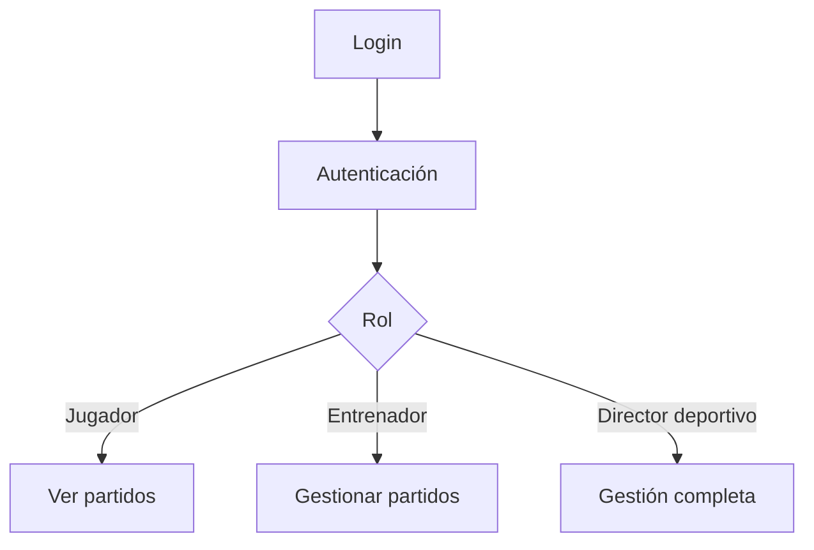
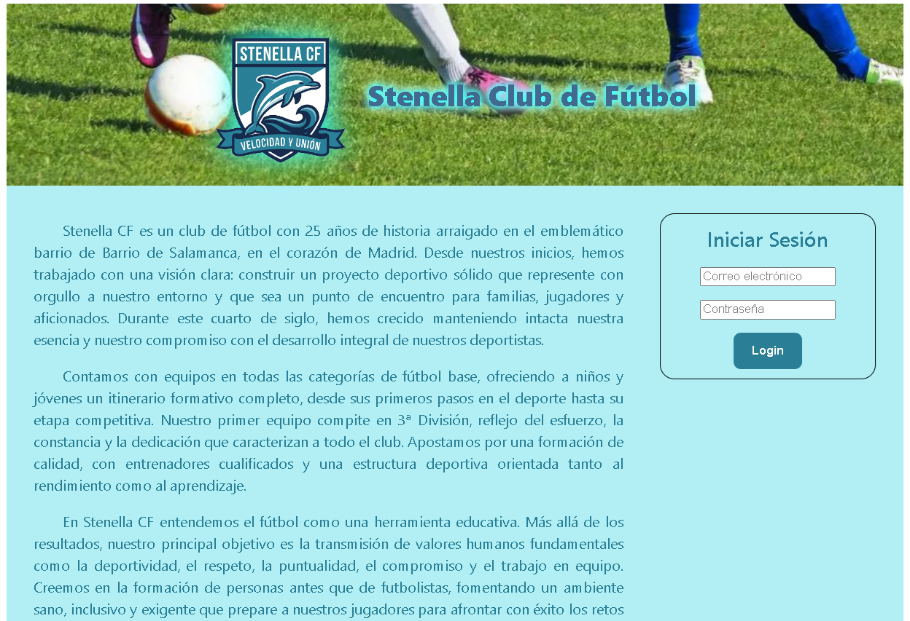
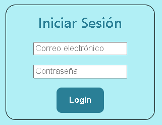
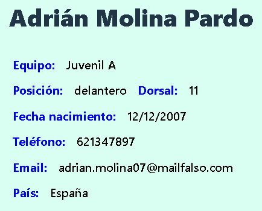
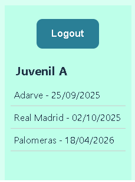
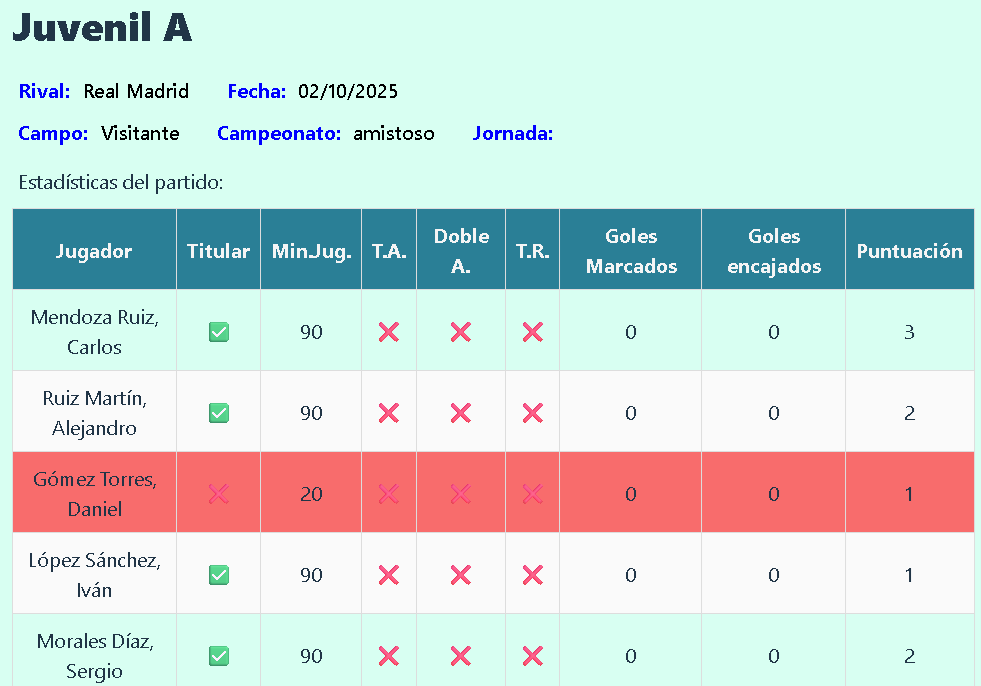
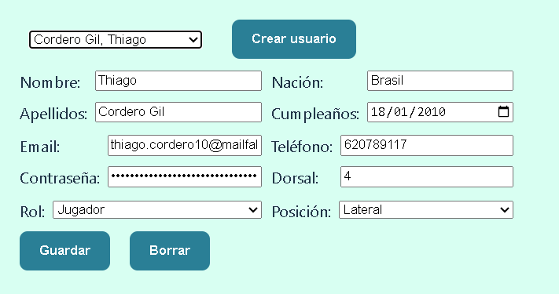

# STENELLA CLUB DE FÚTBOL

Aplicación **Full Stack** orientada a la gestión integral de un club de fútbol, permitiendo administrar equipos, jugadores, partidos y estadísticas mediante una interfaz intuitiva y segmentada por roles de usuario.

---

## Descripción

STENELLA es una **Single Page Application (SPA)** conectada a una base de datos, diseñada para cubrir necesidades reales de gestión deportiva.

El sistema permite a los distintos perfiles del club acceder a información relevante según su rol, facilitando tanto la consulta como la administración de datos clave del equipo.

Proyecto desarrollado con enfoque escalable, preparado para futuras ampliaciones como control de entrenamientos, scouting o tienda online.

---

## Tecnologías

### Frontend
- React
- Vite
- React Router
- React Hook Form
- CSS

### Backend
- Node.js
- Express
- MongoDB + Mongoose
- JWT (autenticación)
- Bcrypt

---

## Estructura del proyecto
ProyectoFinal/  
├── backend/  
└── frontend/  

---

## Roles de usuario

- **Jugador** → Consulta de partidos y estadísticas  
- **Entrenador** → Gestión de partidos y estadísticas  
- **Director deportivo** → Gestión completa del sistema  

---

## Funcionalidades

- Autenticación con JWT  
- Control de acceso por roles  
- Gestión de usuarios  
- Gestión de equipos  
- Creación y edición de partidos  
- Registro de estadísticas por jugador  

---

## Instalación

```bash
git clone https://github.com/luigiSotomayor/proyectofinal.git
cd proyectofinal
```
Backend
```bash
cd backend
npm install
npm run dev
```
Frontend
```bash
cd frontend
npm install
npm run dev
```
## Escalabilidad

Es sistema está preparado para incorporar nuevas funcionalidades como:
- Control de entrenamientos
- Sistema de scouting
- Tienda online

## Flujo de la aplicación


## Contribuciones

1. Fork del proyecto
2. Crear rama:
```bash
git checkout -b feature/nueva-funcionalidad
```
3. Pull Request

## Imágenes

Página de inicio  


Detalle del login  


Detalle de la información de un jugador al entrar en su usuario  


Detalle del menú al que tiene acceso un jugador  


Cómo se ven las estadísticas de un partido  


Formulario para dar de alta a un jugador  


## Autor

Luis Sotomayor  
https://github.com/luigisotomayor

