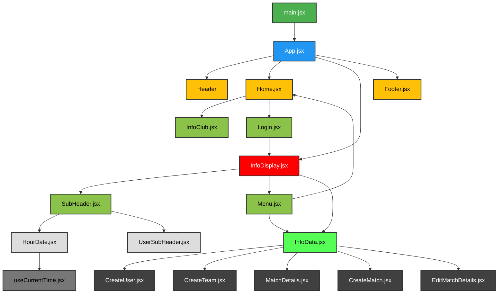

# 📖 STENELLA CLUB DE FÚTBOL

<div style="text-align: justify">En este proyecto lo que se busca es dar una solución informática a un club de fútbol. Se trata de una SPA conectada a una base de datos donde todos los usuarios del club previamente logeados podrán acceder a diferentes informaciones respecto a los partidos.

En esta primera versión está implementado la información y estadísticas de los partidos, así como la gestión de usuarios y equipos. Este proyecto es ampliamente escalable con más funcionalidades propias de un club de Fútbol como control de asistencias a los entrenamientos, jugadores controlados por los observadores, tienda online y un largo etcétera.</div>

## ✒️ Exigencias del proyecto:

- Proyecto Full Stack.
- Backend con Node.js
- Frontend con React.
- Temática libre pero que solucione algún problema.
- Libertad en el uso de librerías.
- Tener un excel de al menos 100 datos que se utilizará como semilla. Con un mínimo de 2 o 3 colecciones relacionadas.
- Utilizar la lectura de archivos de Node.js para crear las semillas necesarias para llenar nuestra base de datos.
- Una de las colecciones tendrá que ser de usuarios, en este caso con roles en cada usuario.
- Estructura lógica de los componentes del frontend.
- UX/UI intuitiva y que todo tenga sentido.
- Crear un Readme que documente el proyecto.

## ✒️ Tecnologías usadas:

- react
- react-dom
- react-router-dom
- react-hook-form
- react-toastify
- CSS
- bcrypt
- cors
- express
- jsonwebtoken
- mongoose
- nodemon
- dotenv

## ✒️ Estructura de archivos:

backend/  
├── src/  
│ ├── api/  
│ │   ├── controllers  
│ │   ├── models  
│ │   ├── routes  
│ ├── config/  
│ ├── middlewares/  
│ ├── seeds/  
│ ├── utils/  
│ └── index.js  
frontend/  
├── public/  
├── src/  
│ ├── assest/  
│ ├── components/  
│ ├── context/  
│ ├── hooks/  
│ ├── pages/  
│ ├── styles/  
│ ├── utils/  
│ ├── App.jsx  
│ └── main.jsx  
└── index.html   
 

## ✒️ Estructura del proyecto:



## ✒️ Instalación:
```bash
git clone https://github.com/luigiSotomayor/proyectofinal.git
cd proyectofinal
npm install
npm run dev
```

## ✒️ Modo de Uso:

<div style="text-align: justify">La aplicación se abre con una página de inicio que presenta al club y un cuadro de login para introducir email y contraseña.

Al logearse de forma correcta se presenta la información del usuario logeado y un menú que depende del role del usuario.  
El usuario que es jugador podrá ver la información y estadísticas de los partidos de su equipos.  
El que tenga perfil de entrenador podrá crear partidos nuevos para los equipos que entrena y podrá editar dichos partidos, poniéndo las estadísticas de cada uno de ellos.  
El que se logee como director deportivo tendrá acceso a casi todo. Será el que tiene credenciales para dar de alta / baja y editar tanto usuarios como equipos del club, así como acceso a todas las estadísticas e información de todos los partidos del club.  
Todos los usuarios tienen la opción de hacer logout en el momento que considere oportuno.</div>

## ✒️ Funcionalidades: 
- Usuarios logeados con perfil. 
- Muestra la fecha y hora actuales. 
- Muestra los datos del usuario logeado. 
- Dependiendo del role tienen acceso a diferentes funcionalidades:
  * Jugador: ver su información y consultar las estadísticas de los partidos de su equipo.
  * Entrenador: ver su información y gestionar los partidos de sus equipos: dar de alta partidos, poner estadísticas de los mismos
  * Director deportivo: a parte de ver su información, gestión de usuarios (dar de alta / baja / editar), gestión de equipo (alta / baja / edición) y consultar todos los datos de todos los equipos y sus partidos.

## ✒️ Contribuciones:
Para contribuir con este proyecto puedes hacer lo siguiente: 
1. Haz un fork del proyecto. 
2. Crea una rama: `git checkout -b feature/nueva-funcionalidad` (en nueva-funcionalidad pon el nombre de tu funcionalidad). 
3. Envía el pull request.

## ✒️ Autor:
Este web esta creada y diseñada por Luis Sotomayor.  
Puedes contactar conmigo a través de mi [github](https://github.com/luigiSotomayor)
